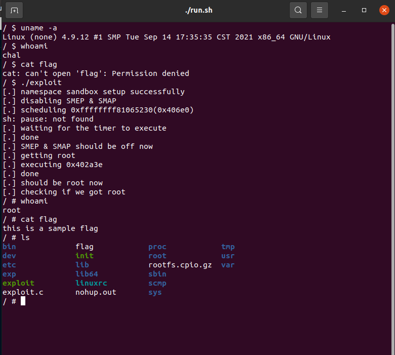

#  CVE-2017-6074

## Bug overview

Giao thức DCCP (Datagram Congestion Control Protocol) khi được triển khai ở trạng thái listen, tại hàm `dccp_rcv_state_process()`, một `skb` sẽ được free nếu `dccp_v6_conn_request()` trả về thành công. Tuy nhiên nếu `IPV6_RECVPKTINFO` được sử dụng thì địa chỉ của `skb` được lưu lại tiếp tục dùng cho tới khi hủy socket do `inet6_destroy_sock()` sẽ free lại lần nữa. Điều này dẫn tới lỗi `use-after-free` và `Double free`

## Vulnerability description

### phân loại lỗ hổng

- Leo thang đặc quyền

### Vulnerability code

`net/dccp/input.c`

```c
int dccp_rcv_state_process(struct sock *sk, struct sk_buff *skb,
			   struct dccp_hdr *dh, unsigned int len)
{
	struct dccp_sock *dp = dccp_sk(sk);
	struct dccp_skb_cb *dcb = DCCP_SKB_CB(skb);
	const int old_state = sk->sk_state;
	int queued = 0;
	... ...
	if (sk->sk_state == DCCP_LISTEN) {
		if (dh->dccph_type == DCCP_PKT_REQUEST) {
			if (inet_csk(sk)->icsk_af_ops->conn_request(sk,skb) < 0)		
            // Nếu như dccp_v6_conn_request() trả về thành công
								    
				return 1;
			goto discard;
		}
	
	... ...
	if (!queued) {
discard:
		__kfree_skb(skb);										
        // free skb
	}
	return 0;
}
```

`dccp_rcv_state_ process()` xử lý packet yêu cầu, nếu trạng thái giao thức DCCP là LISTEN và yêu cầu là gói tin `DCCP_PKT_REQUEST` thì sẽ gọi hàm `dccp_v6_conn_request()`

```C
static int dccp_v6_conn_request(struct sock *sk, struct sk_buff *skb)
{
	struct request_sock *req;
	struct dccp_request_sock *dreq;
	struct inet_request_sock *ireq;
	struct ipv6_pinfo *np = inet6_sk(sk);
	const __be32 service = dccp_hdr_request(skb)->dccph_req_service;
	struct dccp_skb_cb *dcb = DCCP_SKB_CB(skb);
	... ...
	ireq = inet_rsk(req);
	ireq->ir_v6_rmt_addr = ipv6_hdr(skb)->saddr;
	ireq->ir_v6_loc_addr = ipv6_hdr(skb)->daddr;
	ireq->ireq_family = AF_INET6;

	if (ipv6_opt_accepted(sk, skb, IP6CB(skb)) ||
	    np->rxopt.bits.rxinfo || np->rxopt.bits.rxoinfo ||		// Có thể vượt qua bằng setsockopt() và IPV6_RECVPKTINFO 
	    np->rxopt.bits.rxhlim || np->rxopt.bits.rxohlim) {
		atomic_inc(&skb->users);								// Tăng thêm lượng tham chiếu của skb
		ireq->pktopts = skb;									// Lưu địa chỉ của skb vào ireq->pktopts。
	}
	
	... ...
}
```

Khi đặt giá trị flag `IPV6_RECVPKTINFO` thì giá trị của np->rxopt.bits.rxinfo sẽ là True để đáp ứng điều kiện. Số lượng tham chiếu của skb sẽ tăng thêm 1 đánh dấu skb vẫn còn được sử dụng và địa chỉ được lưu vào ` ireq->pktopts`. Sau khi gọi `dccp_v6_conn_request()` và trả về thành công thì skb sẽ bị cưỡng bức giải phóng do việc hàm `dccp_rcv_state_ process()` nhảy tới `discard`. Việc này là free dư thừa và sẽ gây ra `Double free` khi hủy socket. 

## Exploitation

### Trigger bug
[1] Tạo `socket(PF_INET6, SOCK_DCCP, IPPROTO_IP)` và listen socket
[2] Đặt flag `IPV6_RECVPKTINFO` của socket sao cho thỏa mãn điều kiện tại hàm `dccp_v6_conn_request()` để kích hoạt lại free skb

### Heap spraying

[1] Tạo forge struct `ubf_info` để  gọi tới (*callback)
```c
struct sk_buff {
	union {
		struct {
			/* These two members must be first. */
			struct sk_buff		*next;
			struct sk_buff		*prev;

			union {
				ktime_t		tstamp;
				struct skb_mstamp skb_mstamp;
			};
		};
		struct rb_node	rbnode; /* used in netem & tcp stack */
	};
	struct sock		*sk;
	struct net_device	*dev;
  ... ... 
  /* These elements must be at the end, see alloc_skb() for details.  */
	sk_buff_data_t		tail;
	sk_buff_data_t		end;
	unsigned char		*head, *data;					
    // [head + end] ----> 		skb_shared_info							
	unsigned int		truesize;
	atomic_t		users;
};

struct skb_shared_info {
	unsigned char	nr_frags;
	__u8		tx_flags;
	unsigned short	gso_size;
	/* Warning: this field is not always filled in (UFO)! */
	unsigned short	gso_segs;
	unsigned short  gso_type;
	struct sk_buff	*frag_list;
	struct skb_shared_hwtstamps hwtstamps;
	u32		tskey;
	__be32          ip6_frag_id;

	/*
	 * Warning : all fields before dataref are cleared in __alloc_skb()
	 */
	atomic_t	dataref;

	/* Intermediate layers must ensure that destructor_arg
	 * remains valid until skb destructor */
	void *		destructor_arg;											
    // trỏ đến ubuf_info

	/* must be last field, see pskb_expand_head() */
	skb_frag_t	frags[MAX_SKB_FRAGS];
};

struct ubuf_info {
	void (*callback)(struct ubuf_info *, bool zerocopy_success);		// <------------ target cần đạt được
	void *ctx;
	unsigned long desc;
};
```

[2] `callback function` sẽ được gọi lại trong hàm `skb_release_data()`      
Ta có thể gọi tới hàm đó theo :
`dccp_close() -> inet_csk_destroy_sock() -> dccp_v6_destroy_sock() -> inet6_destroy_sock() -> kfree_skb() -> __kfree_skb() -> skb_release_all() -> skb_release_data()`

```C
tatic struct proto dccp_v6_prot = {
	.name		   = "DCCPv6",
	.owner		   = THIS_MODULE,
	.close		   = dccp_close,				
    // close(socket) -> dccp_close() ->  ...  ->      sk->sk_prot->destroy(sk)
	... ...
	.destroy	   = dccp_v6_destroy_sock,
	...	...
};

static void skb_release_data(struct sk_buff *skb)
{
	struct skb_shared_info *shinfo = skb_shinfo(skb);			
	int i;

	if (skb->cloned &&
	    atomic_sub_return(skb->nohdr ? (1 << SKB_DATAREF_SHIFT) + 1 : 1,
			      &shinfo->dataref))
		return;

	for (i = 0; i < shinfo->nr_frags; i++)
		__skb_frag_unref(&shinfo->frags[i]);

	/*
	 * If skb buf is from userspace, we need to notify the caller
	 * the lower device DMA has done;
	 */
	if (shinfo->tx_flags & SKBTX_DEV_ZEROCOPY) {
		struct ubuf_info *uarg;

		uarg = shinfo->destructor_arg;
		if (uarg->callback)																	// thực thi callback từ forge struct ubf_info
			uarg->callback(uarg, true);
	}

	if (shinfo->frag_list)
		kfree_skb_list(shinfo->frag_list);

	skb_free_head(skb);
}

#define skb_shinfo(SKB)	((struct skb_shared_info *)(skb_end_pointer(SKB)))

static inline unsigned char *skb_end_pointer(const struct sk_buff *skb)
{
	return skb->head + skb->end;
}
```
### Disable SMEP/SMAP
1. Cấp phát đối tượng packet_sock sau packet_ring_buffer memory.

	`packet_set_ring()->init_prb_bdqc()->prb_setup_retire_blk_timer()->prb_init_blk_timer()`

2. Nối packet_ring_buffer nhận vào đối tượng packet_sock để đặt bộ hẹn giờ hủy kích hoạt khối bộ nhớ.
3. Làm tràn bộ nhớ này, ghi đè lên retire_blk_timer. Đặt retire_blk_timer->func trỏ thành native_write_cr4 và đặt giá trị của retire_blk_timer->data bằng với giá trị thanh ghi CR4 được yêu cầu.

	`packet_sock->rx_ring->prb_bdqc->retire_blk_timer->data`
4. Đợi bộ đếm thời gian thực thi, bây giờ chúng ta có thể tắt SMEP và SMAP trên lõi CPU hiện tại.

### Get root
Sử dụng forge struct `ubf_info` đã tạo (skb-> ... ->desturationor_arg->callback) trỏ tới hàm `commit_creds(prepare_kernel_cred(0))` để thực hiện leo thang đặc quyền

Nếu tệp đặc quyền có thể được đọc, điều đó có nghĩa là quá trình leo thang đặc quyền thành công và quy trình con fork sẽ eject shell, tránh giải phóng sk_buff và gây ra sự cố.

### Result




### một vài lưu ý khi khai thác

Khi SMEP/SMAP được đóng, khi heap spraying sẽ bao phủ đối tượng packet_sock có kích thước 0x580. Khi leo thang được đặc quyền thì heap spraying sẽ bao phủ vùng dữ liệu được chỉ ra bởi sk_buff và khối heap nơi đặt cấu trúc skb_shared_info , với kích thước 0x800. Hai đối tượng này nằm trong khối heap có kích thước 0x800 nên kích thước dữ liệu placeholder gửi trong exp là 1536 là 0x600, kích thước sau khi căn chỉnh là 0x800.

## Affect range

- Các phiên bản bị ảnh hưởng: Linux v2.6.14 - v4.9.13.


## The patch

- Bản vá đã khắc phục bằng cách thay vì nhảy tới discard thì gọi hàm `consume_skb()` tránh giải phóng cưỡng chế skb

```c
diff --git a/net/dccp/input.c b/net/dccp/input.c
index ba347184bda9b..8fedc2d497709 100644
--- a/net/dccp/input.c
+++ b/net/dccp/input.c
@@ -606,7 +606,8 @@ int dccp_rcv_state_process(struct sock *sk, struct sk_buff *skb,
 			if (inet_csk(sk)->icsk_af_ops->conn_request(sk,
 								    skb) < 0)
 				return 1;
-			goto discard;
+			consume_skb(skb);
+			return 0;
 		}
 		if (dh->dccph_type == DCCP_PKT_RESET)
 			goto discard;
```
## Conclusion

Việc khai thác có thể chỉ phù hợp với một số phiên bản kernel. Kernel có thể bị crash do memomry corruption vì không phân bổ lại các objects theo đúng thứ tự hoặc không kịp thời gian.

## References

- [What I Learnt From the CVE-2016-8655 Exploit](https://www.anquanke.com/post/id/85162)
- [The CVE-2017-6074 Exploit](https://xairy.io/articles/cve-2017-6074)